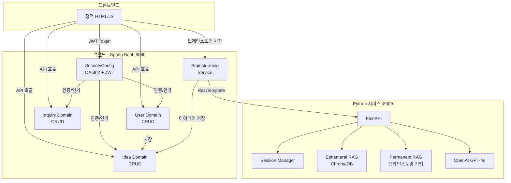
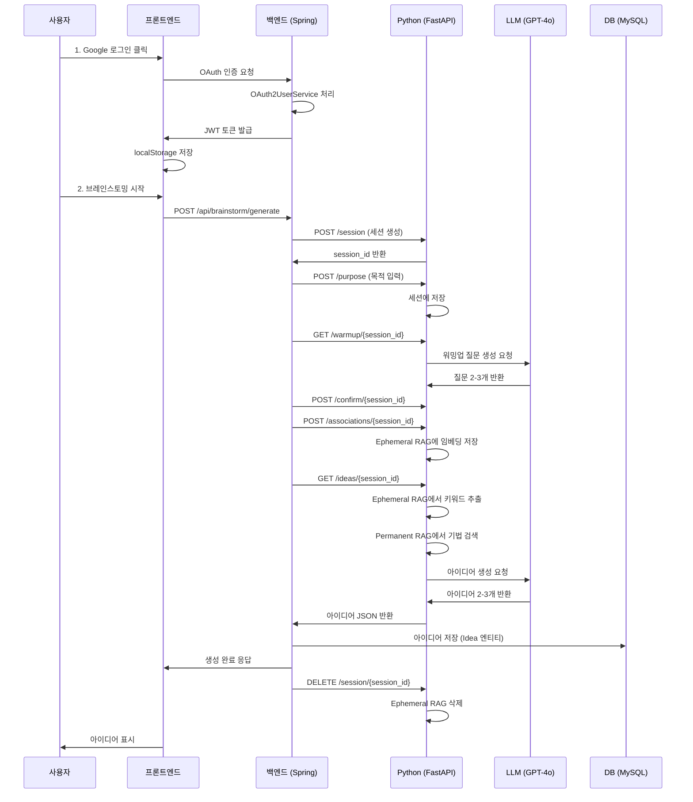

# 코드베이스 전반 검토 리포트

## 📋 프로젝트 개요

**브레인스토밍 플랫폼** - AI 기반 아이디어 생성 서비스

### 기술 스택 요약

| 계층 | 기술 | 버전/특징 |
|------|------|-----------|
| **백엔드** | Spring Boot | 3.5.7 (Java 17) |
| **프론트엔드** | 정적 HTML/JS | Vanilla JS |
| **AI 서비스** | Python FastAPI | 1.0.0 |
| **데이터베이스** | MySQL + H2 | JPA 기반 |
| **인증** | OAuth 2.0 + JWT | Google, Kakao, Naver |
| **AI** | OpenAI GPT-4o | LangChain + ChromaDB RAG |

---

## 🏗️ 아키텍처 구조



---

## 1️⃣ 백엔드 (Spring Boot) 분석

### 도메인 구조

#### 📁 User Domain (사용자 관리)
- **엔티티**: `User.java`
  - `userId` (PK), `email`, `username`, `provider`, `providerId`, `role`
  - OAuth 제공자별 사용자 정보 통합 관리
  
- **컨트롤러**: 
  - `AuthController` - 인증 관련 API
  - `UserController` - 사용자 정보 API

- **주요 기능**:
  - OAuth 2.0 소셜 로그인 (Google, Kakao, Naver)
  - JWT 토큰 발급 및 검증
  - 사용자 정보 조회 및 업데이트

#### 📁 Idea Domain (아이디어 관리)
- **엔티티**: `Idea.java`
  - `ideaId` (PK), `userId` (FK), `title`, `content` (TEXT), `purpose`
  - 브레인스토밍 결과물 저장

- **컨트롤러**: `IdeaController`
  - `GET /api/ideas?userId={userId}` - 사용자별 아이디어 목록 조회
  - `POST /api/ideas` - 아이디어 생성
  - `GET /api/ideas/{id}` - 아이디어 상세 조회

#### 📁 Inquiry Domain (문의 관리)
- **엔티티**: `Inquiry.java`
  - 문의 상태 관리 (`InquiryStatus`: PENDING, ANSWERED, CLOSED)

#### 📁 Brainstorming Domain (핵심 비즈니스 로직)
- **서비스**: `BrainstormingService.java`
  - Python FastAPI 호출 (RestTemplate 사용)
  - 7단계 브레인스토밍 워크플로우 오케스트레이션
  - 생성된 아이디어를 DB에 자동 저장

### 보안 구조

#### 🔐 OAuth 2.0 구현
- **서비스**: `CustomOAuth2UserService.java`
  - 제공자별 사용자 정보 파싱 (Google, Kakao, Naver)
  - 신규 사용자 자동 회원가입
  - 기존 사용자 정보 업데이트

- **UserInfo 구현체**:
  - `GoogleUserInfo`
  - `KakaoUserInfo`
  - `NaverUserInfo`

#### 🔑 JWT 구현
- **토큰 제공자**: `JwtTokenProvider.java`
  - HMAC-SHA 기반 서명 (jjwt 0.12.6)
  - 토큰 생성, 검증, 사용자 ID 추출
  - 만료 시간 관리

- **필터**: `JwtAuthenticationFilter.java`
  - `Authorization: Bearer {token}` 헤더 검증
  - Spring Security 컨텍스트에 인증 정보 설정

#### 🛡️ Security 설정
- **설정**: `SecurityConfig.java`
  - OAuth2 로그인 성공 시 JWT 발급
  - JWT 필터를 `UsernamePasswordAuthenticationFilter` 앞에 배치
  - CSRF 비활성화 (REST API)
  - H2 콘솔 접근 허용 (개발용)

### 의존성 관리

`build.gradle`
```gradle
- Spring Boot 3.5.7
- Spring Security + OAuth2 Client
- JWT (jjwt 0.12.6)
- JPA + MySQL + H2
- Lombok
- Validation
```

---

## 2️⃣ 프론트엔드 분석

### 기술 스택
- **프레임워크**: 없음 (Vanilla JS)
- **구조**: 정적 HTML + CSS + JavaScript
- **파일 구성**:
  - `index.html` - 메인 페이지
  - `brainstorm.html` - 브레인스토밍 페이지
  - `oauth-callback.html` - OAuth 콜백 처리
  - `js/main.js` - 메인 로직

### 주요 기능

#### 인증 처리
- **로그인 모달**: OAuth 제공자 선택 (Google, Kakao, Naver)
- **토큰 관리**: `localStorage`에 JWT 저장
- **자동 로그인 확인**: 
  ```javascript
  // main.js:13-54
  async function checkLoginStatus() {
      const token = localStorage.getItem('token');
      // /api/auth/me 호출로 토큰 검증
  }
  ```

#### API 통신
- **Base URL**: `http://localhost:8080/api`
- **인증 헤더**: `Authorization: Bearer {token}`
- **주요 엔드포인트**:
  - `GET /auth/me` - 사용자 정보 조회
  - `GET /ideas?userId={userId}` - 아이디어 목록
  - `POST /ideas` - 아이디어 생성

#### UI/UX
- **네비게이션**: 로그인/로그아웃 상태 표시
- **사이드바**: 나의 아이디어 목록
- **브레인스토밍 플로우**: 5단계 시각화 (목적 → 워밍업 → 자유연상 → AI 분석 → 아이디어 생성)

---

## 3️⃣ Python 서비스 (FastAPI) 분석

### 구조

#### 📁 API 엔드포인트
`brainstorming.py` (712줄)

**7단계 워크플로우**:
1. `POST /session` - 세션 생성
2. `POST /purpose` - Q1 목적 입력
3. `GET /warmup/{session_id}` - Q2 워밍업 질문 생성 (LLM)
4. `POST /confirm/{session_id}` - Q2 확인
5. `POST /associations/{session_id}` - Q3 자유연상 입력 (Ephemeral RAG 저장)
6. `GET /ideas/{session_id}` - 아이디어 생성 (핵심!)
7. `DELETE /session/{session_id}` - 세션 삭제

#### 🧠 RAG 시스템 (이중 구조)

##### Ephemeral RAG (세션별 임시 데이터)
- **목적**: 사용자가 입력한 자유연상 키워드를 ChromaDB에 임베딩
- **저장 위치**: `python-service/app/domain/brainstorming/data/ephemeral/{session_id}/`
- **생명주기**: 세션 종료 시 자동 삭제 (5분 이상 된 빈 폴더 자동 정리)
- **활용**: 아이디어 생성 시 유사도 기반 키워드 추출 (top_k=5)

##### Permanent RAG (브레인스토밍 기법)
- **목적**: 브레인스토밍 기법 문서를 영구 저장
- **저장 위치**: `python-service/app/domain/brainstorming/data/chroma/`
- **컬렉션**: `brainstorming_techniques`
- **활용**: 아이디어 생성 시 목적에 맞는 기법 3개 검색

#### 🤖 LLM 활용

**모델**: GPT-4o (OpenAI)

**주요 프롬프트**:
1. **워밍업 질문 생성** (brainstorming.py:259-276)
   - 사용자 직군 추론 (유튜버, 소상공인, 개발자 등)
   - 직군별 맞춤 질문 2-3개 생성

2. **아이디어 생성** (brainstorming.py:451-553)
   - **입력**: 목적 + 자유연상 키워드 + RAG 기법 + 도메인 힌트
   - **출력**: 2-3개 아이디어 (제목, 핵심 문제, 개선 방안, 기대 효과, 발상 기법, SWOT 분석)
   - **제약 조건**:
     - 허구 데이터 절대 금지 (통계, 비용 등)
     - 현실적 실행 가능성 (며칠~몇 주 내 시작 가능)
     - 직군별 맞춤 (유튜버 → 휴대폰 촬영, 소상공인 → 네이버/인스타 등)

#### 🔧 헬퍼 함수
- **Retry 로직**: `llm_helpers.py`
  - LLM 호출 실패 시 자동 재시도
- **Dependencies**: `dependencies.py`
  - 세션 존재 여부 검증 (`get_session_or_404`)

### 의존성

`requirements.txt`
```
fastapi==0.115.0
uvicorn==0.32.0
openai==1.57.0
langchain==0.3.27
chromadb==0.5.23
pydantic==2.12.4
```

---

## 📊 통합 플로우 분석

### 사용자 시나리오: 아이디어 생성



---

## ✅ 장점 분석

### 1. 명확한 도메인 분리
- User, Idea, Inquiry, Brainstorming 도메인이 독립적으로 관리됨
- 각 도메인별 Controller-Service-Repository 패턴 준수

### 2. 보안 구조가 탄탄함
- OAuth 2.0 + JWT 이중 인증
- 제공자별 UserInfo 추상화로 확장성 확보
- JWT 필터를 통한 API 보호

### 3. AI 서비스 분리
- Python FastAPI로 AI 로직을 별도 서비스화
- Java 백엔드는 비즈니스 로직에만 집중
- RestTemplate로 느슨한 결합 유지

### 4. RAG 시스템 설계
- Ephemeral RAG: 세션별 임시 데이터 (자동 정리)
- Permanent RAG: 브레인스토밍 기법 영구 저장
- ChromaDB 기반 벡터 검색으로 관련성 높은 정보 추출

### 5. 프롬프트 엔지니어링
- 허구 데이터 금지 명시
- 직군별 맞춤 아이디어 생성
- SWOT 분석 자동화

---

## ⚠️ 개선 제안사항

### 1. 프론트엔드 현대화
> **현재**: Vanilla JS + 정적 HTML

**제안**:
- React 또는 Vue.js 도입
- TypeScript 적용
- 컴포넌트 기반 아키텍처

**이유**:
- 상태 관리 복잡도 증가 시 유지보수 어려움
- 코드 재사용성 낮음
- 타입 안정성 부족

### 2. 에러 처리 강화
> **현재**: 기본적인 try-catch만 존재

**제안**:
- 전역 예외 핸들러 (`@ControllerAdvice`)
- 커스텀 예외 클래스 정의
- 에러 응답 표준화 (RFC 7807 Problem Details)

**예시**:
```java
@ControllerAdvice
public class GlobalExceptionHandler {
    @ExceptionHandler(ResourceNotFoundException.class)
    public ResponseEntity<ErrorResponse> handleNotFound(ResourceNotFoundException e) {
        return ResponseEntity.status(404).body(new ErrorResponse(e.getMessage()));
    }
}
```

### 3. 테스트 코드 부재
> **현재**: 테스트 코드 없음

**제안**:
- 단위 테스트 (JUnit 5 + Mockito)
- 통합 테스트 (Spring Boot Test)
- Python 서비스 테스트 (pytest)

**우선순위**:
1. BrainstormingService 테스트 (Python 호출 모킹)
2. JwtTokenProvider 테스트
3. CustomOAuth2UserService 테스트

### 4. 환경 변수 관리
> **현재**: `application.yaml`이 gitignore에 포함됨

**제안**:
- `application-example.yaml` 템플릿 제공
- 민감 정보는 환경 변수로 주입
- Spring Cloud Config 또는 AWS Secrets Manager 고려

### 5. API 문서화
> **현재**: 문서 없음

**제안**:
- Spring REST Docs 또는 Swagger/OpenAPI
- Python FastAPI 자동 문서 (`/docs`) 활용

### 6. 로깅 전략
> **현재**: 기본 로깅만 존재

**제안**:
- 구조화된 로깅 (JSON 포맷)
- 로그 레벨 관리 (개발/운영 환경 분리)
- ELK 스택 또는 CloudWatch 연동 고려

### 7. 성능 최적화
> **현재**: RestTemplate 동기 호출

**제안**:
- WebClient로 비동기 호출 전환
- Python 서비스 응답 캐싱 (Redis)
- DB 쿼리 최적화 (N+1 문제 확인)

### 8. 보안 강화
> **현재**: 개발 단계에서 모든 요청 허용

**제안**:
```java
// SecurityConfig.java
.authorizeHttpRequests(auth -> auth
    .requestMatchers("/", "/login", "/oauth2/**").permitAll()
    .requestMatchers("/api/ideas/**").authenticated()  // 인증 필요
    .requestMatchers("/api/admin/**").hasRole("ADMIN") // 관리자만
    .anyRequest().authenticated()
)
```

### 9. Python 서비스 개선
> **현재**: 세션 데이터가 메모리에만 존재

**제안**:
- Redis로 세션 관리 (분산 환경 대비)
- 세션 타임아웃 설정
- Rate Limiting 추가 (DDoS 방지)

### 10. CI/CD 파이프라인
> **현재**: 수동 배포

**제안**:
- GitHub Actions 또는 Jenkins
- 자동 테스트 + 빌드 + 배포
- Docker 컨테이너화

---

## 🎯 우선순위별 개선 로드맵

### Phase 1: 안정성 (1-2주)
1. ✅ 전역 예외 핸들러 추가
2. ✅ 핵심 비즈니스 로직 단위 테스트
3. ✅ 로깅 전략 수립 및 적용
4. ✅ `application-example.yaml` 템플릿 생성

### Phase 2: 보안 강화 (1주)
1. ✅ API 엔드포인트별 권한 설정
2. ✅ CORS 정책 명확화
3. ✅ Rate Limiting 추가 (Python)

### Phase 3: 성능 개선 (2주)
1. ✅ RestTemplate → WebClient 전환
2. ✅ Redis 캐싱 도입
3. ✅ DB 인덱스 최적화

### Phase 4: 현대화 (4주)
1. ✅ 프론트엔드 React 전환
2. ✅ API 문서 자동화
3. ✅ CI/CD 파이프라인 구축

---

## 📝 결론

### 전반적 평가
- **아키텍처**: 잘 설계된 마이크로서비스 구조 (백엔드 + AI 서비스 분리)
- **보안**: OAuth 2.0 + JWT 조합으로 견고함
- **AI 통합**: RAG 시스템과 프롬프트 엔지니어링이 인상적
- **코드 품질**: 도메인 분리가 명확하고 가독성 좋음

### 주요 강점
1. Spring Boot 3.x 최신 기술 스택 사용
2. 이중 RAG 시스템 (Ephemeral + Permanent)
3. 직군별 맞춤 아이디어 생성 로직
4. OAuth 제공자 추상화로 확장성 확보

### 개선 필요 영역
1. 테스트 코드 부재 (가장 시급)
2. 프론트엔드 현대화 필요
3. 에러 처리 및 로깅 표준화
4. 운영 환경 대비 (모니터링, 배포 자동화)

### 종합 의견
현재 코드베이스는 **MVP(Minimum Viable Product) 단계로서 핵심 기능이 잘 구현**되어 있습니다. 
다음 단계로 **안정성(테스트), 보안(권한 관리), 성능(비동기 처리)** 순으로 개선하면 
프로덕션 레벨로 발전시킬 수 있을 것으로 판단됩니다.
